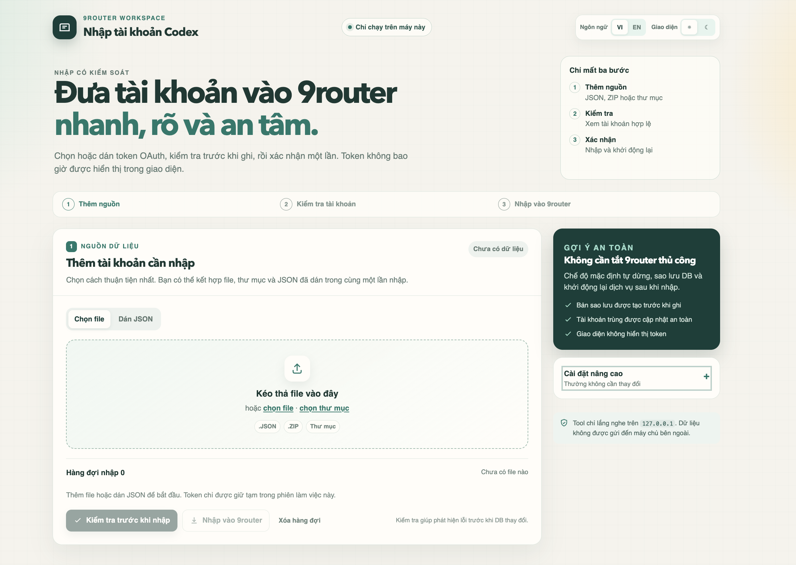
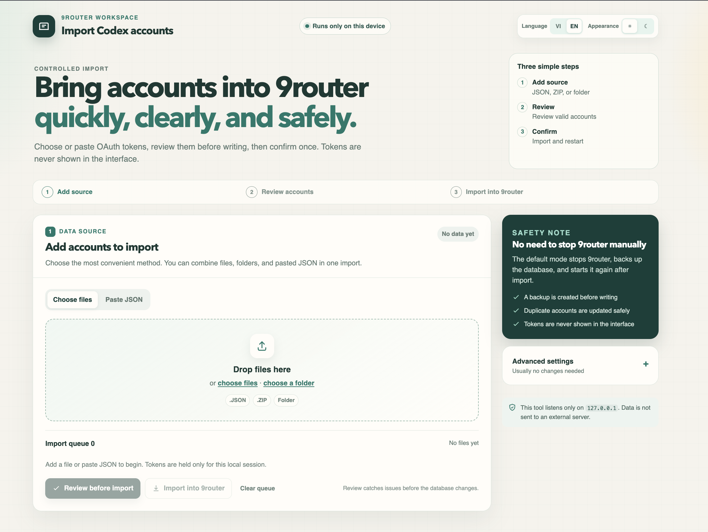

<div align="center">

# 9router Codex Importer

### Nhập OAuth ChatGPT / Codex vào 9router - cục bộ, an toàn, dễ dùng
### Import ChatGPT / Codex OAuth into 9router - local, safe, and simple

[](https://nodejs.org/)


**Chỉ cần nhấp để bắt đầu. Token luôn ở trên máy của bạn.**

[Tiếng Việt](#tieng-viet) · [English](#english) · [Chọn file để mở](#mo-file-nao)

</div>

> [!IMPORTANT]
> Công cụ ghi vào cơ sở dữ liệu 9router trên máy của bạn. Trước khi nhập, công cụ kiểm tra dữ liệu và tạo bản sao lưu DB. Không bao giờ đưa tệp OAuth JSON/ZIP lên GitHub.

## Xem trước giao diện / Interface preview

<div align="center">
  <a href="docs/screenshots/ui-vietnamese.png">
    
  </a>
  <a href="docs/screenshots/ui-english.png">
    
  </a>
</div>

<p align="center">
  <strong>Tiếng Việt</strong> &middot; Chọn <strong>VI / EN</strong> và giao diện <strong>Sáng / Tối</strong> ở góc trên bên phải.<br>
  <strong>English</strong> &middot; Switch <strong>VI / EN</strong> and <strong>Light / Night</strong> from the upper-right corner.
</p>

Nhấp vào ảnh để xem kích thước đầy đủ. / Click an image to view it at full size.

<a id="mo-file-nao"></a>

## Mở File Nào?

| Bạn đang dùng | Lần đầu tiên | Những lần sau |
| --- | --- | --- |
| **Windows** | Nhấp đúp [`setup.cmd`](setup.cmd) | Nhấp đúp [`run.cmd`](run.cmd) |
| **macOS** | Nhấp đúp [`setup.command`](setup.command) | Nhấp đúp [`run.command`](run.command) |

`setup` kiểm tra Node.js, tạo thư mục `tokens` và tự mở giao diện. `run` chỉ mở giao diện nên nhanh hơn cho các lần sau.

> [!TIP]
> Trên macOS, nếu hệ thống chặn file `.command`: giữ `Control` + click file → chọn **Open** → xác nhận một lần. Sau đó chỉ cần nhấp đúp như bình thường.

---

<a id="tieng-viet"></a>

## Tiếng Việt

### Dành cho ai?

Đây là công cụ nhập hàng loạt tài khoản ChatGPT / Codex từ tệp OAuth JSON vào 9router trên chính máy của bạn. Giao diện có hướng dẫn từng bước, hỗ trợ **Tiếng Việt / English** và **Sáng / Tối**.

| Công cụ tự làm | Lợi ích cho bạn |
| --- | --- |
| Chỉ chạy tại `127.0.0.1` | Token không bị gửi đến máy chủ bên ngoài. |
| Kiểm tra trước khi nhập | Thấy email, gói tài khoản, hạn dùng và lỗi trước khi DB thay đổi. |
| Sao lưu trước khi ghi | Có bản backup có timestamp để khôi phục khi cần. |
| Xử lý tài khoản trùng | Cập nhật token mới an toàn, không tạo bản sao dư thừa. |
| Tự dừng / khởi động lại 9router | Không cần thao tác thủ công trong hầu hết trường hợp. |

### Yêu cầu trước khi dùng

1. Máy Windows 10/11 hoặc macOS.
2. Cài **Node.js 18 trở lên** từ [nodejs.org](https://nodejs.org/).
3. Đã cài và từng mở 9router ít nhất một lần để 9router tạo cơ sở dữ liệu.
4. Tải source code về máy rồi giải nén.

Không cần chạy `npm install`.

### Bắt đầu trong 3 bước

1. Mở file `setup` đúng với máy của bạn theo bảng [Mở File Nào?](#mo-file-nao).
2. Khi trình duyệt tự mở, chọn **VI / EN** và giao diện **Sáng / Tối** ở góc trên bên phải nếu muốn.
3. Thêm JSON/ZIP, bấm **Kiểm tra**, rồi bấm **Xác nhận và nhập**.

### Hướng dẫn dùng giao diện

#### 1. Thêm dữ liệu tài khoản

Chọn một trong ba cách:

- **Kéo thả** file `.json`, `.zip` hoặc thư mục vào vùng giữa màn hình.
- Bấm **chọn file** hoặc **chọn thư mục**.
- Chuyển qua tab **Dán JSON**, dán một hoặc nhiều JSON rồi bấm **Thêm vào hàng đợi**. Có thể dùng `Ctrl + Enter` trên Windows hoặc `Cmd + Enter` trên macOS.

> [!TIP]
> Nếu dùng CLI, bạn có thể đặt file vào thư mục `tokens/`. Thư mục này được Git bỏ qua để tránh lộ token.

#### 2. Kiểm tra trước

Bấm **Kiểm tra trước khi nhập**. Tool sẽ hiển thị dữ liệu hợp lệ, dữ liệu cần xem lại và không thay đổi database ở bước này.

#### 3. Xác nhận nhập

Bấm **Xác nhận và nhập**. Tùy chọn tự dừng và mở lại 9router được bật sẵn để tránh xung đột database. Sau khi hoàn tất, kiểm tra tài khoản trong 9router tại provider Codex / ChatGPT.

### Dùng CLI khi cần

GUI phù hợp cho đa số người dùng. Dùng CLI khi cần xử lý theo lô, ZIP lớn hoặc tự động hóa.

```zsh
# Kiểm tra file trong tokens/ - không ghi database
node import.js --list

# Nhập toàn bộ file trong tokens/ và tự xử lý 9router nếu đang chạy
node import.js ./tokens --force-stop

# Nhập một file hoặc ZIP cụ thể
node import.js /duong-dan/toi/account.json --force-stop
node import.js /duong-dan/toi/accounts.zip --force-stop

# Nhập nhưng không cập nhật cấu hình Codex CLI
node import.js ./tokens --force-stop --no-configure-codex
```

Trên Windows dùng `node .\import.js ...`; trên macOS dùng `node ./import.js ...`.

| Tùy chọn | Ý nghĩa |
| --- | --- |
| `--list` / `--dry-run` | Chỉ kiểm tra, không ghi database. |
| `--force-stop` | Tự dừng 9router, ghi DB rồi mở lại. |
| `--no-restart` | Không mở lại 9router sau khi nhập. |
| `--no-configure-codex` | Không cập nhật `~/.codex/config.toml` và `auth.json`. |
| `--db <đường-dẫn>` | Chỉ định DB `data.sqlite` hoặc `db.json` khác. |
| `--url <URL>` | Đổi URL kiểm tra 9router; mặc định `http://127.0.0.1:20128`. |

### Dữ liệu được hỗ trợ

| Loại | Hỗ trợ | Ghi chú |
| --- | --- | --- |
| JSON OAuth đơn | Có | Dùng `access_token`, `refresh_token`, `id_token`, `email`... |
| Mảng JSON / wrapper `accounts` / `tokens` | Có | Hỗ trợ dạng export phổ biến của Codex CLI và công cụ quản lý tài khoản. |
| ZIP | Có | Hỗ trợ STORE/DEFLATE; không hỗ trợ ZIP64. |
| Thư mục | Có | Quét đệ quy mọi `.json` và `.zip`. |

Để bảo vệ app, ZIP có giới hạn **5.000 entry**, **32 MiB cho mỗi JSON** và **64 MiB dữ liệu sau giải nén**. GUI giới hạn request **32 MiB**. Khi file lớn, hãy chia nhỏ thành các lô.

### An toàn và riêng tư

> [!CAUTION]
> OAuth JSON/ZIP chứa thông tin đăng nhập. Không gửi qua chat, issue, ảnh chụp màn hình hoặc commit vào Git.

- `tokens/*`, database, backup và `.env` đã nằm trong `.gitignore`.
- GUI không hiển thị đầy đủ access token hoặc refresh token.
- DB được backup trước khi ghi; `~/.codex/config.toml` cũng được backup trước khi cập nhật.
- Sau khi nhập thành công, GUI/CLI có thể cấu hình Codex CLI dùng API key của 9router. Dùng `--no-configure-codex` nếu bạn không muốn CLI bị thay đổi.

### Xử lý lỗi nhanh

| Lỗi | Cách xử lý |
| --- | --- |
| Không tìm thấy Node.js | Cài Node.js 18+ rồi chạy lại `setup.cmd` / `setup.command`. |
| macOS chặn file `.command` | `Control` + click → **Open** → xác nhận. |
| 9router đang chạy | Dùng GUI mặc định hoặc thêm `--force-stop` trong CLI. |
| Không thấy file | Chọn file/thư mục trực tiếp, hoặc bỏ JSON/ZIP vào `tokens/`. |
| ZIP quá lớn | Chia ZIP thành lô nhỏ hơn giới hạn và thử lại. |
| Muốn kiểm tra nhưng không nhập | Dùng nút **Kiểm tra** hoặc lệnh `node import.js --list`. |

---

<a id="english"></a>

## English

### Who is this for?

This tool bulk-imports ChatGPT / Codex OAuth JSON exports into a local 9router installation. The guided interface supports **Vietnamese / English** and **Light / Night** appearances.

| What it does | Why it matters |
| --- | --- |
| Runs only on `127.0.0.1` | OAuth tokens stay on your computer. |
| Reviews before import | See email, plan, expiry, and errors before the database changes. |
| Backs up before writing | A timestamped database backup is created for recovery. |
| Safely handles duplicates | Refreshes matching accounts instead of copying them blindly. |
| Coordinates 9router | Can stop and restart 9router automatically. |

### Requirements

1. Windows 10/11 or macOS.
2. **Node.js 18 or newer** from [nodejs.org](https://nodejs.org/).
3. A local 9router installation that has been started at least once.
4. A downloaded or cloned copy of this repository.

`npm install` is not required.

### Start in 3 steps

1. Open the correct `setup` file from [Which File Should I Open?](#which-file-should-i-open).
2. The browser opens automatically. Choose **VI / EN** and **Light / Night** in the top-right if needed.
3. Add JSON/ZIP files, choose **Review**, then **Confirm import**.

<a id="which-file-should-i-open"></a>

### Which File Should I Open?

| Your computer | First time | Later |
| --- | --- | --- |
| **Windows** | Double-click [`setup.cmd`](setup.cmd) | Double-click [`run.cmd`](run.cmd) |
| **macOS** | Double-click [`setup.command`](setup.command) | Double-click [`run.command`](run.command) |

`setup` verifies Node.js, creates `tokens`, and opens the interface automatically. `run` opens the interface directly.

> [!TIP]
> If macOS blocks a downloaded `.command` file: Control-click it, select **Open**, and confirm once.

### Using the interface

#### 1. Add accounts

- Drag `.json`, `.zip`, or a folder into the central drop area.
- Or click **choose files** / **choose a folder**.
- Or select **Paste JSON**, paste one or more JSON objects, and click **Add to queue**. Use `Ctrl + Enter` on Windows or `Cmd + Enter` on macOS.

#### 2. Review

Select **Review before import**. This step validates the queue without changing the database.

#### 3. Import

Select **Confirm import**. Automatic 9router stop/restart is enabled by default to prevent database conflicts. Then check the Codex / ChatGPT provider in 9router.

### CLI reference

Use the CLI for automation, batch processing, or archives that are too large for the GUI.

```zsh
# Review tokens/ without database changes
node import.js --list

# Import every supported file in tokens/
node import.js ./tokens --force-stop

# Import a specific JSON file or ZIP archive
node import.js /path/to/account.json --force-stop
node import.js /path/to/accounts.zip --force-stop

# Do not change the local Codex CLI configuration
node import.js ./tokens --force-stop --no-configure-codex
```

On Windows use `node .\import.js ...`; on macOS use `node ./import.js ...`.

| Option | Meaning |
| --- | --- |
| `--list` / `--dry-run` | Review only; never writes the database. |
| `--force-stop` | Stop 9router, write the DB, then restart it. |
| `--no-restart` | Do not restart 9router after importing. |
| `--no-configure-codex` | Do not update `~/.codex/config.toml` or `auth.json`. |
| `--db <path>` | Use a specific `data.sqlite` or legacy `db.json`. |
| `--url <URL>` | Change the 9router health URL; default: `http://127.0.0.1:20128`. |

### Supported input and limits

| Input | Supported | Notes |
| --- | --- | --- |
| OAuth JSON object | Yes | Reads common fields such as `access_token`, `refresh_token`, `id_token`, and `email`. |
| JSON array / `accounts` / `tokens` wrapper | Yes | Supports common Codex CLI and account-manager exports. |
| ZIP archive | Yes | STORE and DEFLATE only; ZIP64 is not supported. |
| Folder | Yes | Recursively scans `.json` and `.zip` files. |

For local protection, ZIP extraction is limited to **5,000 entries**, **32 MiB per JSON**, and **64 MiB total decoded JSON**. The GUI request limit is **32 MiB**. Split a large archive into smaller batches first.

### Privacy and safety

> [!CAUTION]
> OAuth JSON/ZIP files contain credentials. Never commit, share, screenshot, or paste them into an issue.

- `tokens/*`, databases, backups, and `.env` are excluded by `.gitignore`.
- The GUI does not show full access or refresh tokens.
- The DB is backed up before writing; `~/.codex/config.toml` is backed up before changes.
- A successful GUI/CLI import can configure the local Codex CLI to use a 9router API key. Use `--no-configure-codex` in the CLI to opt out.

### Troubleshooting

| Problem | Fix |
| --- | --- |
| Node.js is missing | Install Node.js 18+, then run `setup.cmd` / `setup.command` again. |
| macOS blocks `.command` | Control-click → **Open** → confirm. |
| 9router is running | Use the GUI default or add `--force-stop` in the CLI. |
| No input files | Select files/folders directly or add JSON/ZIP to `tokens/`. |
| ZIP is too large | Split it into smaller archives and retry. |
| Need a safe preview | Use the **Review** button or `node import.js --list`. |

---

## Project Layout

```text
.
├── setup.cmd / setup.command  # First-time check + automatic GUI launch
├── run.cmd / run.command      # Open the GUI on later uses
├── gui.html / gui.js           # Bilingual local web interface
├── import.js                   # Command-line importer
├── importer-core.js            # Parser, backup, DB import, 9router coordination
├── zip-reader.js               # Dependency-free ZIP reader with safety limits
├── tokens/.gitkeep             # Empty, Git-safe import folder
└── README.md                   # This guide
```

## Before You Publish or Update

```zsh
git status
git check-ignore -v tokens/example.json
git add .
git diff --cached --check
```

The package remains `private` and `UNLICENSED` to prevent accidental npm publishing. Add an explicit license before permitting reuse or outside contributions.
